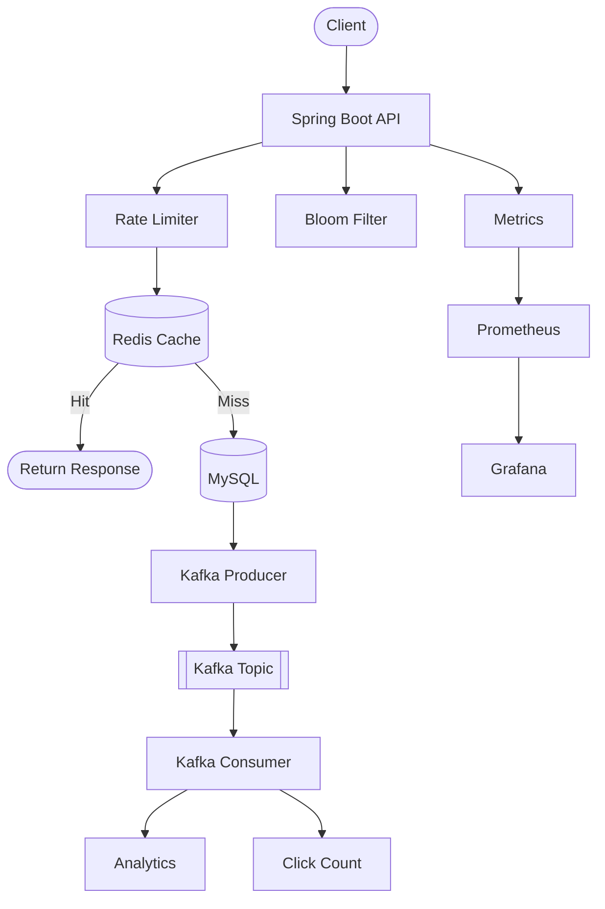

# SystemDesignLab

Building distributed systems from scratch using Java & Spring Boot

---

## 1. URL Shortener

A production-inspired URL Shortener built with Spring Boot demonstrating modern backend engineering concepts beyond basic CRUD operations.

### Features

- Generate short URLs using Snowflake IDs and Base62 encoding
- Redis Cache with Cache-Aside pattern
- Bloom Filter to reduce unnecessary database lookups
- Kafka-based asynchronous analytics processing
- Redis-backed IP rate limiting
- Circuit breaker with graceful fallback using Resilience4j
- Idempotent Kafka consumer
- Metrics using Micrometer
- Monitoring with Prometheus & Grafana
- Dockerized infrastructure (MySQL, Redis, Kafka, Prometheus, Grafana)

### Architecture

### Technologies Used

| Category | Technologies |
|---|---|
| **Backend** | Java 21, Spring Boot, Spring MVC, Spring Data JPA, Hibernate, Maven |
| **Database** | MySQL |
| **Cache** | Redis |
| **Messaging** | Apache Kafka |
| **Resilience** | Resilience4j |
| **Monitoring** | Micrometer, Prometheus, Grafana |
| **Infrastructure** | Docker, Docker Compose |
| **Utilities** | Snowflake ID Generator, Base62 Encoding, Bloom Filter |
