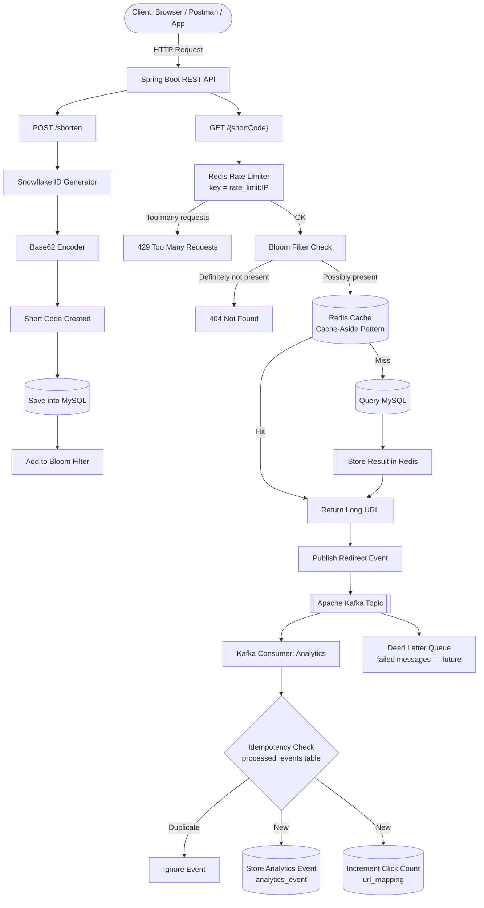
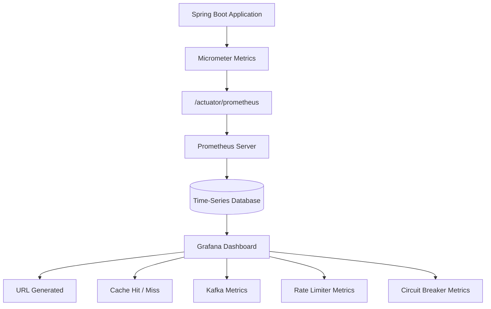
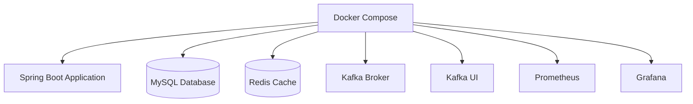

# Production-Grade URL Shortener — Architecture

## Complete Request Flow

## Monitoring & Observability

## Infrastructure (Docker)

## Failure Handling

**Redis down:**
`Redis Down` → `Circuit Breaker Opens` → `Skip Cache` → `Use MySQL Directly`

**Rate limiter's Redis down:**
`Rate Limiter Redis Down` → `Fallback` → `Allow Request`

**Kafka down:**
`Kafka Down` → `Redirect Still Works` → `Analytics Temporarily Lost`

> In a future version, the Outbox Pattern and a Dead Letter Queue would ensure those analytics aren't lost.

## Components Used

- **Client**
  - Spring Boot
    - REST Controller
    - Service Layer
    - Repository Layer
    - Global Exception Handler
    - Validation
    - Snowflake Generator
    - Base62 Encoder
    - Bloom Filter
    - Redis Cache
    - Redis Rate Limiter
    - Circuit Breaker (Resilience4j)
    - Kafka Producer
    - Kafka Consumer
    - Idempotent Consumer
    - Micrometer Metrics
  - MySQL
  - Redis
  - Kafka
  - Prometheus
  - Grafana
  - Docker

## What an Interviewer Can Infer From This Project

This single project demonstrates experience with:

### Backend

- Java
- Spring Boot
- REST APIs
- JPA / Hibernate
- Layered Architecture

### Databases

- MySQL
- Redis

### Distributed Systems

- Event-Driven Architecture
- Kafka
- Idempotent Consumer
- Cache-Aside Pattern
- Bloom Filter
- Snowflake IDs
- Base62 Encoding

### Resilience

- Circuit Breaker
- Graceful Fallback
- Rate Limiting

### Observability

- Micrometer
- Prometheus
- Grafana
- Custom Metrics

### Infrastructure

- Docker
- Docker Compose
